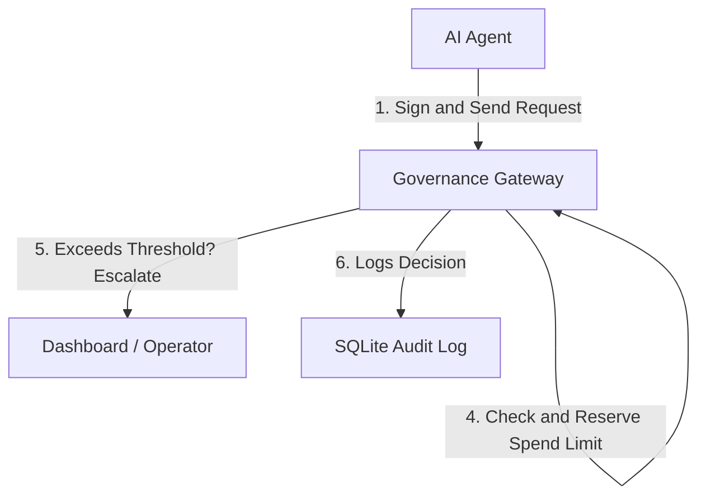

# Financial Agent Governance Layer

A security gateway and dashboard designed to authorize, limit, and monitor AI financial agents. This repository implements message signing, deterministic RBAC/ABAC rules, atomic daily budget capping, human-in-the-loop operator approval, and an emergency stop.

---

## Core Mechanism

The system enforces security and financial boundaries in the following order:



### Signature Verification Demo
Agents sign their payloads with an HMAC-SHA256 signature calculated over the alphabetically sorted keys:

```python
import hmac
import hashlib
import json
import time

# 1. Agent signs the request
def create_signed_request(agent_id: str, action: str, amount: int, secret: str) -> dict:
    payload = {
        "agent_id": agent_id,
        "action_type": action,
        "amount": amount,
        "timestamp": int(time.time()),
        "request_id": f"req_{int(time.time() * 1000)}"
    }
    # Sort keys alphabetically to construct the canonical body
    canonical_body = json.dumps(payload, sort_keys=True, separators=(',', ':'))
    payload["signature"] = hmac.new(
        secret.encode('utf-8'),
        canonical_body.encode('utf-8'),
        hashlib.sha256
    ).hexdigest()
    return payload

# 2. Gateway verifies the request
def verify_signature(payload: dict, secret: str) -> bool:
    sig_to_verify = payload.get("signature")
    data = {k: v for k, v in payload.items() if k != "signature"}
    canonical_body = json.dumps(data, sort_keys=True, separators=(',', ':'))
    computed_sig = hmac.new(
        secret.encode('utf-8'),
        canonical_body.encode('utf-8'),
        hashlib.sha256
    ).hexdigest()
    return hmac.compare_digest(computed_sig, sig_to_verify)
```

---

## Submission Clean-up Instructions

Before zipping the project for submission, delete temporary files and cached dependencies to keep the file size minimal:

*   **Exclude/Delete:** `frontend/node_modules/`
*   **Exclude/Delete:** `gateway/__pycache__/` and `gateway/scripts/__pycache__/`
*   **Exclude/Delete:** `gateway/.pytest_cache/`
*   **Exclude/Delete:** `gateway/governance.db` (will auto-generate on startup)
*   **Exclude/Delete:** `~$Pitch_deck.pptx` (temporary lock file)

### Package Command (Git Archive)
```bash
git archive --format=zip HEAD -o financial-governance-submission.zip
```

---

## Stepwise Reproduction & Review Tutorial

### 1. Build and Run
Start the database, gateway API, simulator, and operator panel:
```bash
docker compose up --build
```
*   **Gateway Backend**: Runs on `http://localhost:8000`
*   **Dashboard Frontend**: Runs on `http://localhost:5173`

### 2. Execute Automated Tests
Verify code correctness (14 tests covering signatures, replay attacks, policy, and budget caps):
```bash
docker exec -it governance_gateway pytest /app/
```

### 3. Observe Mock Agent Traffic
Stream the simulator log outputs to see decisions under different scenarios (allow, deny, signature mismatch, budget exceeded):
```bash
docker logs -f governance_simulator
```

### 4. Interact with the Operator Panel
1.  Open **`http://localhost:5173`** in your browser.
2.  Approve or deny pending requests in the **ACTIVE ESCALATIONS** pane.
3.  Click the **EMERGENCY STOP** button in the header to halt all agent activity instantly.
